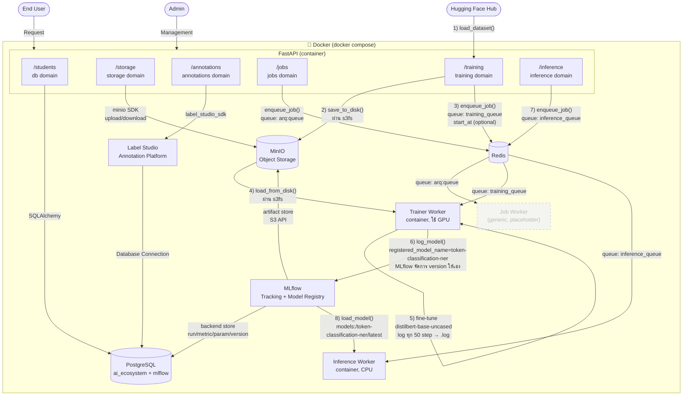

```mermaid
flowchart TB
    EndUser([End User])
    Admin([Admin])
    HuggingFace([Hugging Face Hub])

    EndUser -->|Request| FastAPI
    Admin -->|Management| FastAPI

    subgraph Docker["🐳 Docker (docker compose)"]
        direction TB

        subgraph FastAPI["FastAPI (container)"]
            direction TB
            DB["/students<br/>db domain"]
            Storage["/storage<br/>storage domain"]
            Ann["/annotations<br/>annotations domain"]
            Jobs["/jobs<br/>jobs domain"]
            Training["/training<br/>training domain"]
            Inference["/inference<br/>inference domain"]
        end

        Postgres[("PostgreSQL<br/>ai_ecosystem + mlflow")]
        MinIO[("MinIO<br/>Object Storage")]
        LabelStudio["Label Studio<br/>Annotation Platform"]
        Redis[("Redis")]
        MLflow["MLflow<br/>Tracking + Model Registry"]
        JobWorker["Job Worker<br/>(generic, placeholder)"]
        TrainerWorker["Trainer Worker<br/>container, ใช้ GPU"]
        InferenceWorker["Inference Worker<br/>container, CPU"]
    end

    HuggingFace -->|"1) load_dataset()"| Training

    DB -->|SQLAlchemy| Postgres
    Storage -->|minio SDK<br/>upload/download| MinIO
    Ann -->|label_studio_sdk| LabelStudio
    Jobs -->|"enqueue_job()<br/>queue: arq:queue"| Redis
    Training -->|"2) save_to_disk()<br/>ผ่าน s3fs"| MinIO
    Training -->|"3) enqueue_job()<br/>queue: training_queue<br/>start_at (optional)"| Redis
    Inference -->|"7) enqueue_job()<br/>queue: inference_queue"| Redis

    Redis -->|"queue: arq:queue"| JobWorker
    Redis -->|"queue: training_queue"| TrainerWorker
    Redis -->|"queue: inference_queue"| InferenceWorker

    MinIO -->|"4) load_from_disk()<br/>ผ่าน s3fs"| TrainerWorker
    TrainerWorker -->|"5) fine-tune<br/>distilbert-base-uncased<br/>log ทุก 50 step → .log"| TrainerWorker
    TrainerWorker -->|"6) log_model()<br/>registered_model_name=token-classification-ner<br/>MLflow จัดการ version ให้เอง"| MLflow

    MLflow -->|backend store<br/>run/metric/param/version| Postgres
    MLflow -->|artifact store<br/>S3 API| MinIO
    MLflow -->|"8) load_model()<br/>models:/token-classification-ner/latest"| InferenceWorker

    LabelStudio -->|Database Connection| Postgres

    classDef notbuilt stroke-dasharray: 5 5,opacity:0.55;
    class JobWorker notbuilt
```
